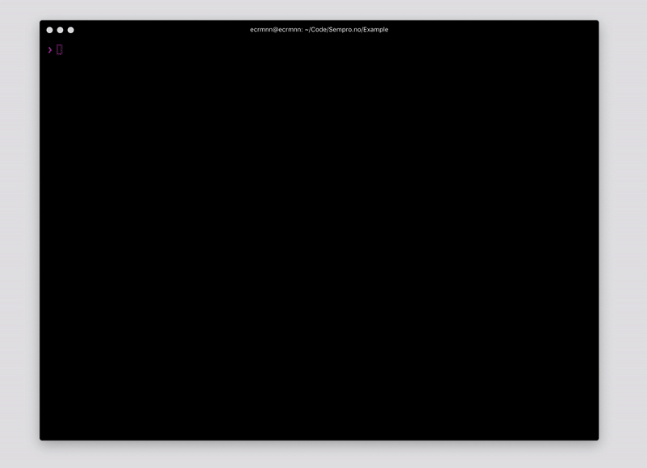

# phpunit-pretty-io
> ✅ Make your PHPUnit output beautiful

[](https://travis-ci.com/sempro/phpunit-pretty-print)
[](https://packagist.org/packages/sempro/phpunit-pretty-print)
[](https://packagist.org/packages/sempro/phpunit-pretty-print)
[](http://makeapullrequest.com)
[](http://www.php-fig.org/psr/psr-2/)


### Installation
```bash
composer require frzb/phpunit-pretty-io --dev
```

This package supports PHPUnit `9` and `10`.

### Usage
You can specify the printer to use on the phpunit command line:

Use the following:
```bash
php vendor/bin/phpunit --printer 'FRZB\PHPUnit\IO\PrettyInputOutput' tests/
```

Optionally, you can add it to your project's `phpunit.xml` file instead:

```xml
<phpunit
    bootstrap="bootstrap.php"
    colors="true"
    printerClass="FRZB\PHPUnit\IO\PrettyInputOutput" 
/>
```



### Optional

To view progress while tests are running you can set `FRZB_PHPUNIT_PRETTY_IO_PROGRESS=true` as environment variable on your server or within your `phpunit.xml` config file.
```xml
<phpunit>
    <php>
        <env name="FRZB_PHPUNIT_PRETTY_IO_PROGRESS" value="true" />
    </php>
</phpunit>
```
